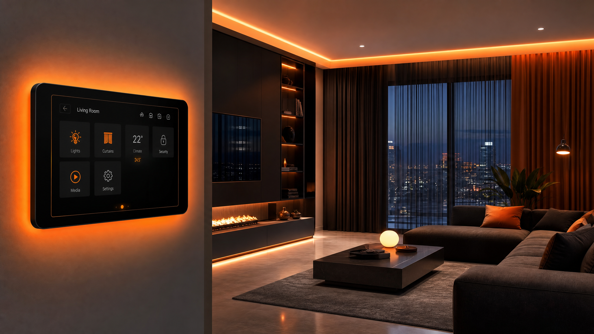

<div align="center">
  

  # PWM Automação Residencial

  Uma landing page moderna e responsiva para apresentar soluções de automação residencial, eficiência energética e integração com inteligência artificial.

  
  
  
  
  
</div>

---



## Sobre o projeto

O **PWM Automação Residencial** é um site institucional desenvolvido para apresentar tecnologias que tornam casas mais inteligentes, seguras e econômicas. A interface combina um visual moderno em tons de laranja, preto e branco com navegação responsiva para computadores, tablets e celulares.

O projeto destaca três soluções principais:

- **Cortinas elétricas:** controle remoto, automação por horário e integração com sensores;
- **Medidores inteligentes:** acompanhamento do consumo de água e energia em tempo real;
- **Integração com IA:** automações que aprendem com os hábitos dos moradores e ajudam a otimizar o consumo.

> **Status:** protótipo front-end. Alguns botões e links ainda exibem ações demonstrativas ou apontam para `#` e podem ser conectados futuramente a formulários, páginas e serviços reais.

## Funcionalidades

- Layout responsivo com menu adaptado para dispositivos móveis;
- Seção principal com apresentação da marca e chamadas para ação;
- Cards de serviços com animações e efeitos de interação;
- Destaques para controle inteligente, economia e segurança;
- Navegação por seções da página;
- Tema visual personalizado e componentes reutilizáveis;
- Página de erro 404;
- Servidor Express para disponibilizar a aplicação em produção.

## Tecnologias

| Tecnologia | Utilização |
| --- | --- |
| [React](https://react.dev/) | Construção da interface e dos componentes |
| [TypeScript](https://www.typescriptlang.org/) | Tipagem estática do código |
| [Vite](https://vite.dev/) | Ambiente de desenvolvimento e build |
| [Tailwind CSS](https://tailwindcss.com/) | Estilização responsiva |
| [Radix UI](https://www.radix-ui.com/) | Base para componentes acessíveis |
| [Lucide React](https://lucide.dev/) | Ícones da interface |
| [Framer Motion](https://motion.dev/) | Suporte a animações |
| [Wouter](https://github.com/molefrog/wouter) | Roteamento no front-end |
| [Express](https://expressjs.com/) | Servidor da aplicação em produção |
| [pnpm](https://pnpm.io/) | Gerenciamento de dependências |

## Como executar

### Pré-requisitos

Antes de começar, instale:

- [Node.js](https://nodejs.org/) 20.19 ou superior;
- [pnpm](https://pnpm.io/installation) 10 ou superior;
- [Git](https://git-scm.com/) para clonar o repositório.

### Instalação

```bash
# Clone o repositório
git clone <URL_DO_REPOSITORIO>

# Acesse a pasta do projeto
cd site-automacao-residencial

# Instale as dependências
pnpm install

# Inicie o ambiente de desenvolvimento
pnpm dev
```

Depois, abra no navegador o endereço exibido pelo Vite — normalmente:

```text
http://localhost:3000
```

## Scripts disponíveis

| Comando | Descrição |
| --- | --- |
| `pnpm dev` | Inicia o servidor de desenvolvimento |
| `pnpm build` | Gera o front-end e o servidor de produção na pasta `dist` |
| `pnpm start` | Inicia a aplicação compilada na porta `5500` ou na variável `PORT` |
| `pnpm preview` | Abre uma prévia local do build do Vite |
| `pnpm check` | Verifica os tipos TypeScript sem gerar arquivos |
| `pnpm format` | Formata o código com Prettier |

Para executar a versão de produção localmente:

```bash
pnpm build
pnpm start
```

A aplicação ficará disponível, por padrão, em `http://localhost:5500`.

## Estrutura do projeto

```text
site-automacao-residencial/
├── client/
│   ├── public/
│   │   └── images/          # Imagens e identidade visual
│   └── src/
│       ├── components/      # Seções e componentes reutilizáveis
│       ├── contexts/        # Contexto de tema
│       ├── hooks/           # Hooks personalizados
│       ├── lib/             # Funções utilitárias
│       ├── pages/           # Páginas Home e 404
│       ├── App.tsx          # Rotas e provedores da aplicação
│       └── main.tsx         # Ponto de entrada do React
├── patches/                 # Ajustes aplicados a dependências
├── server/
│   └── index.ts             # Servidor Express de produção
├── shared/                  # Constantes compartilhadas
├── package.json             # Dependências e scripts
├── tsconfig.json            # Configuração do TypeScript
└── vite.config.ts           # Configuração do Vite
```

## Próximos passos

- Conectar os botões de orçamento e demonstração a um formulário real;
- Adicionar links oficiais das redes sociais;
- Criar seções completas de contato e sobre a empresa;
- Integrar WhatsApp, e-mail ou uma API de atendimento;
- Adicionar testes automatizados e validação de acessibilidade;
- Publicar uma demonstração online.

## Contribuição

Contribuições são bem-vindas. Para sugerir uma melhoria:

1. Faça um *fork* deste repositório;
2. Crie uma branch: `git checkout -b feature/minha-melhoria`;
3. Faça suas alterações e crie um commit: `git commit -m "feat: adiciona minha melhoria"`;
4. Envie a branch: `git push origin feature/minha-melhoria`;
5. Abra um *Pull Request*.

## Licença

Este projeto declara a licença **MIT** em seu `package.json`. Para completar a distribuição, adicione um arquivo `LICENSE` à raiz do repositório com o texto oficial da licença.

---

<div align="center">
  Desenvolvido com 🧡 para transformar casas em ambientes mais inteligentes.
</div>
